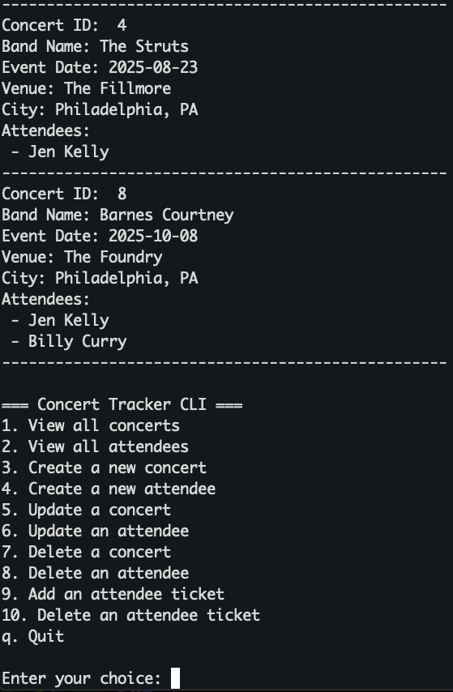
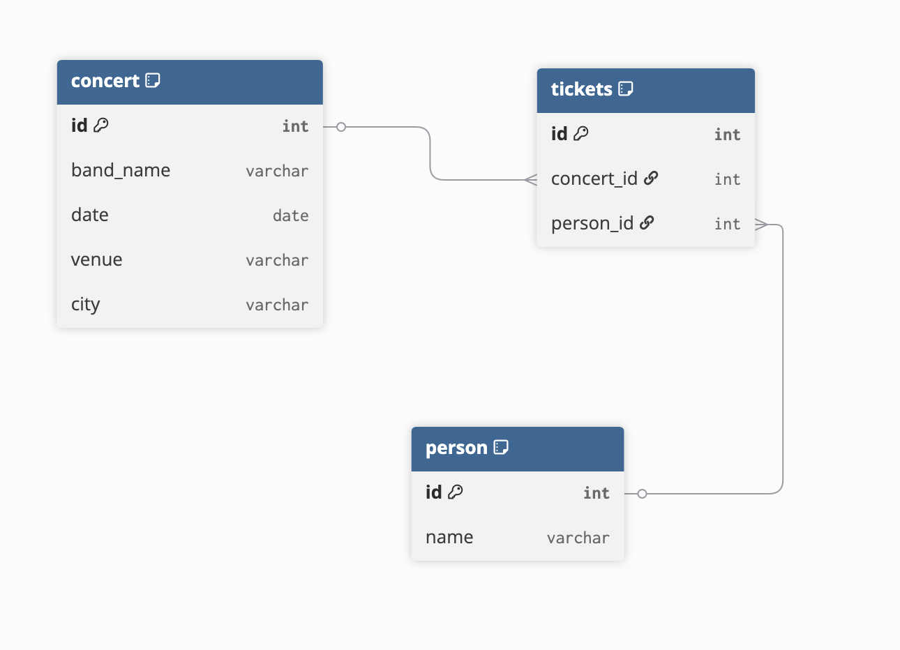

# Concert Tracker

A handy app for the intrepid Concert Goer! View, save and create upcoming concerts and track your fellow attendees and ticket purchases. This app uses a CLI frontend and a Sinatra API backend using Active Record.

## Features

- Create and View lists of Concerts and Attendees
- Update Concert and Attendee details
- Delete and Update Concerts and Attendees
- Add and Delete Tickets for each Attendee

## ERD

## Set Up

To run this App locally, you will need to:

- Run `bundle install` to install dependencies.
- Migrate and seed the database: `bundle exec rake db:migrate db:seed`.
- Start the server: `bundle exec rake server`.
  This will start your API at http://localhost:9292.
- Run the App in a separate terminal: `ruby cli/main.rb`

## Credits

This app was created by Jen Kelly.
